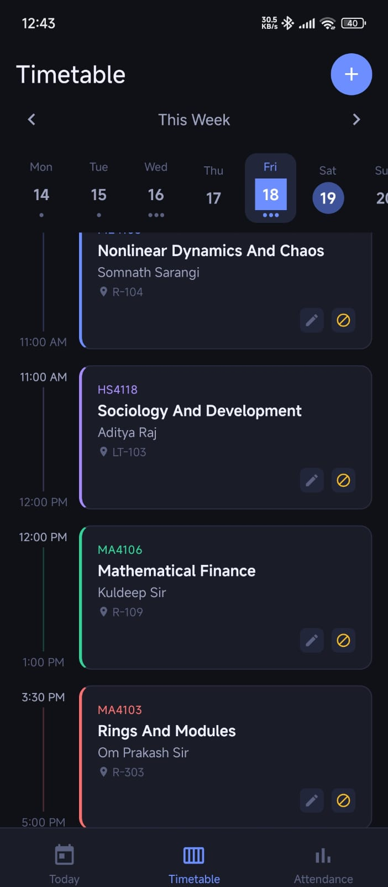
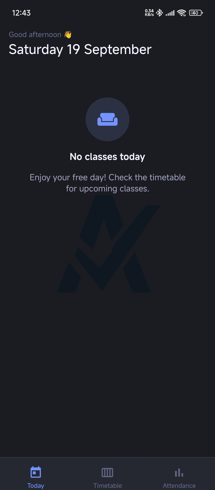
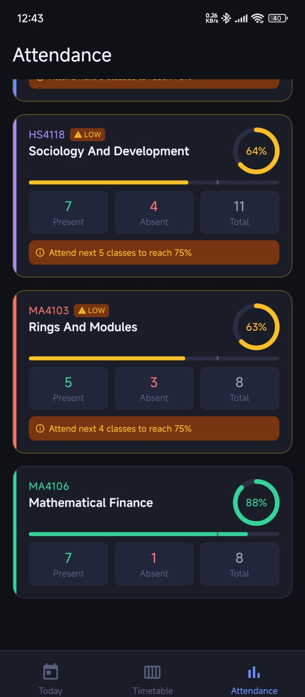

# 📚 Student Attendance & Timetable

A React Native mobile application designed to help students manage their **class timetable**, view their **daily schedule**, and track **subject-wise attendance** in one place.

---

## 📱 Screenshots

### 🗓️ Timetable

Add and manage your weekly classes with subject, instructor, room, and class timings.

<p align="center">
  
</p>

---

### 📅 Daily Schedule

View your classes for the current day. If there are no classes, the app clearly shows that you have a free day.

<p align="center">
  
</p>

---

### 📊 Attendance

Track attendance for every subject with attendance percentage, present/absent counts, and alerts when attendance is low.

<p align="center">
  
</p>

---

## ✨ Features

### 🗓️ Timetable Management

- Add classes to your weekly timetable
- Set class start and end times
- Add subject name and course code
- Add instructor information
- Add classroom/location
- View classes day-wise
- Edit existing classes
- Remove classes

### 📅 Daily Schedule

- View today's classes
- See upcoming classes
- View class timings and locations
- Automatically display a free-day screen when there are no classes

### ✅ Attendance Tracking

- Mark classes as **Present** or **Absent**
- Track attendance subject-wise
- View total classes attended
- View total classes conducted
- View attendance percentage
- Identify subjects with low attendance

### 🎯 Attendance Goals

The app helps you understand how many upcoming classes you need to attend to reach your desired attendance percentage.

For example:

> Attend the next 5 classes to reach 75%.

---

## 🛠️ Tech Stack

- **React Native**
- **TypeScript**
- **Expo**
- **React Navigation**
- **pnpm**

---

## 📂 Project Structure

```text
.
├── assets/
│   └── screenshots/
│       ├── timetable.png
│       ├── today.png
│       └── attendance.png
│
├── src/
│   ├── components/
│   ├── screens/
│   ├── navigation/
│   ├── services/
│   └── ...
│
├── App.tsx
├── package.json
├── pnpm-lock.yaml
└── README.md
````

---

# 🚀 Getting Started

## Prerequisites

Make sure you have the following installed:

* [Node.js](https://nodejs.org/)
* [pnpm](https://pnpm.io/)
* [Expo Go](https://expo.dev/go) for testing on a physical device
* Android Studio for Android Emulator (optional)

You can check your installed versions using:

```bash
node -v
pnpm -v
```

---

## 📥 Clone the Repository

Clone the repository using Git:

```bash
git clone https://github.com/rahul820913/attendence_App.git
```

```bash
cd attendence_App
```

---

## 📦 Install Dependencies

Install all project dependencies using pnpm:

```bash
pnpm install
```

---

## ▶️ Run the Application

Start the Expo development server:

```bash
pnpm exec expo start
```

After the development server starts, you can run the application using:

### 📱 Physical Android/iOS Device

Install **Expo Go** on your phone and scan the QR code shown in the terminal.

### 🤖 Android Emulator

Make sure your Android Emulator is running, then press:

```text
a
```

in the Expo terminal.

Or run:

```bash
pnpm exec expo start --android
```

### 🌐 Web

If web support is configured:

```bash
pnpm exec expo start --web
```

---

# ⚡ Quick Start

If you already have Node.js and pnpm installed, simply run:

```bash
git clone https://github.com/rahul820913/attendence_App.git
cd attendence_App
pnpm install
pnpm exec expo start
````

Then scan the QR code using **Expo Go** or open the application in an emulator.

---

## 📖 How It Works

### 1. Add Your Timetable

Create your weekly schedule by adding:

* Subject name
* Course code
* Instructor
* Classroom
* Start time
* End time
* Day

The timetable is then used to generate your daily schedule.

### 2. View Today's Classes

The **Today** section automatically shows the classes scheduled for the current day.

If no classes are scheduled, the app displays:

> **No classes today**

### 3. Track Attendance

After attending a class, mark it as **Present**.

If you miss a class, mark it as **Absent**.

The attendance percentage is calculated using:

```text
Attendance % = (Classes Present / Total Classes) × 100
```

---

## 📊 Attendance Example

Suppose you have:

```text
Present = 7
Absent  = 4
Total   = 11
```

Your attendance will be:

```text
7 / 11 × 100 = 63.6%
```

The application can also show how many upcoming classes you need to attend to reach a target percentage.

---

## 🔮 Future Improvements

* 🔔 Class reminders and notifications
* 📈 Detailed attendance analytics
* 🎯 Attendance prediction
* 📅 Calendar integration
* ☁️ Cloud synchronization
* 🔐 User authentication
* 📊 Semester-wise attendance reports
* 🌙 Dark/Light theme support
* 📤 Export attendance records
* 🔄 Backup and restore timetable

---

## 🤝 Contributing

Contributions, issues, and feature requests are welcome.

### Fork the repository

Create your own fork of this repository on GitHub.

### Create a new branch

```bash
git checkout -b feature/your-feature
```

### Make your changes

After making your changes, check the project and test the application.

### Commit your changes

```bash
git add .
git commit -m "Add your feature"
```

### Push your branch

```bash
git push origin feature/your-feature
```

Then open a **Pull Request** on GitHub.

---

## 📄 License

This project is licensed under the MIT License.

---

## 👨‍💻 Author

**Rahul Singh Meena**

Built with ❤️ using React Native and TypeScript.


